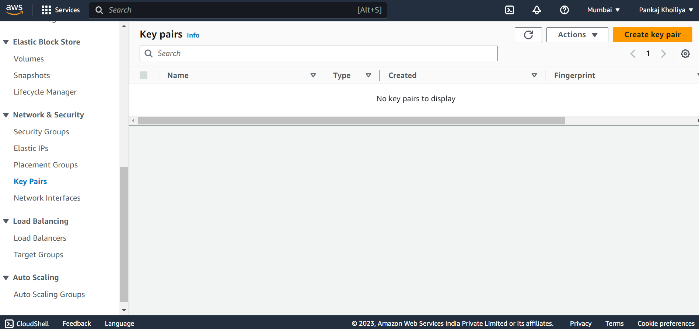
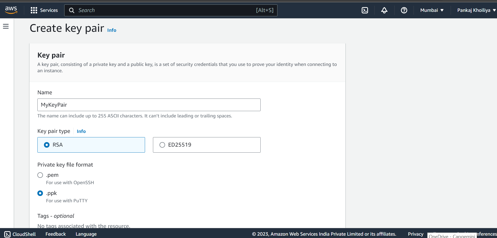
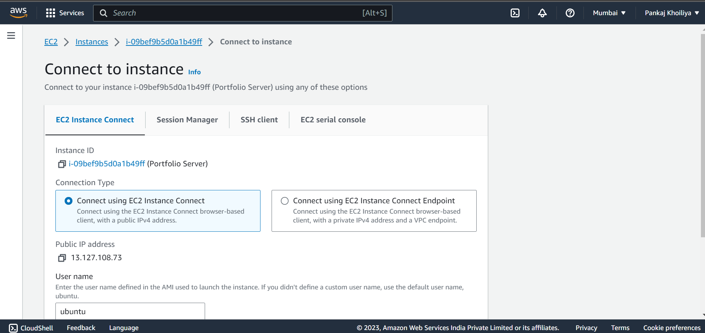
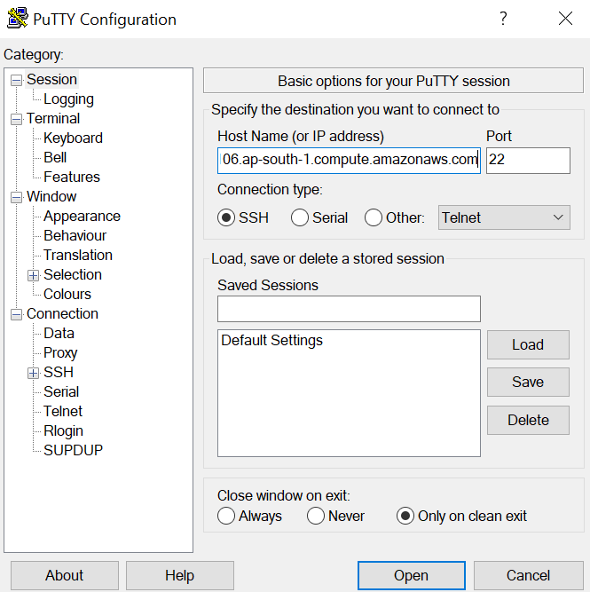
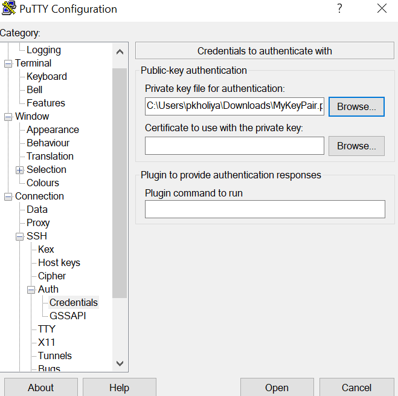
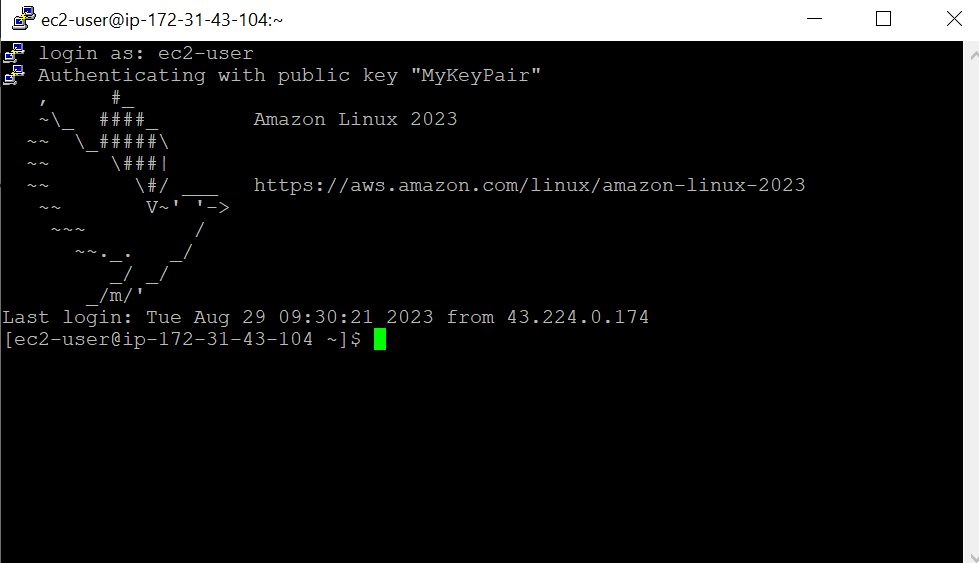

<!-- # Creating an EC2 Instance

This guide will walk you through the process of creating an Amazon EC2 instance, which you can use for hosting your applications, services, and more.

## Prerequisites

- An AWS account with appropriate permissions to create and manage EC2 instances.
- Basic familiarity with the AWS Management Console.
- A key pair for connecting to your EC2 instance (you'll create this during the process).

## Step 1: Sign in to AWS Console

1. Open your web browser and navigate to the [AWS Management Console](https://aws.amazon.com/console/).

2. Sign in with your AWS account credentials.


## Step 2: Creating a key pair

Creating a key pair helps ensure that the correct form of authentication is used when you install Jenkins.

To create your key pair:

1. Open the Amazon EC2 console & [sign in](https://console.aws.amazon.com/ec2/).

2. In the navigation pane, under NETWORK & SECURITY, select Key Pairs.

3. Select Create key pair



4. For Name, enter a descriptive name for the key pair. Amazon EC2 associates the public key with the name that you specify as the key name. A key name can include up to 255 ASCII characters. It cannot include leading or trailing spaces.

5. For File format, select the format in which to save the private key.

    - For OpenSSH compatibility, select pem.

    - For PuTTY compatibility, select ppk

6. Select Create key pair



7. The private key file downloads automatically. The base file name is the name you specified as the name of your key pair, and the file name extension is determined by the file format you chose. Save the private key file in a safe place.

    - This is the only chance for you to save the private key file.

8. If you use an SSH client on a macOS or Linux computer to connect to your Linux instance, run the following command to set the permissions of your private key file so that only you can read it.

    ```bash
    $ chmod 400 <key_pair_name>.pem


## Step 3: Creating a security group

You can refer this documentation for [Security Group](https://www.jenkins.io/doc/tutorials/tutorial-for-installing-jenkins-on-AWS/#creating-a-security-group)


## Step 4: Launch an EC2 Instance

1. In the AWS Management Console, navigate to the EC2 Dashboard.

2. Click the "Launch Instance" button.

3. Choose an Amazon Machine Image (AMI) based on your requirements. Popular choices include Amazon Linux, Ubuntu, and more.


4. Select an instance type based on your needs. The "t2.micro" instance type is often used for testing and small applications.

5. Configure instance details, such as the number of instances, network settings, and storage. Customize these settings based on your project requirements.

6. Add storage based on your needs. You can modify the size and type of the root volume.

7. Configure security groups to control inbound and outbound traffic. Ensure that you allow SSH access (port 22) so you can connect to your instance.

8. Review your configuration and click "Launch" when you're ready.

9. Select an existing key pair or create a new one. This key pair will be used for SSH access to your instance. Download the private key (.pem) file and keep it secure.

## Step 5: Access Your EC2 Instance

1. Locate your EC2 instance in the AWS Management Console.

2. Note the public IP address or DNS name of the instance.

3. **Option 1: Using SSH**

   - Open your terminal or command prompt.

   - Change the permissions of your private key file to restrict access:
     ```
     chmod 400 your-key.pem
     ```

   - Connect to your instance using SSH:
     ```
     ssh -i your-key.pem ec2-user@public-ip-or-dns
     ```

3. **Option 2: Using EC2 Connect**

   EC2 Connect provides a more secure way to connect to your instances by using Systems Manager Session Manager. This eliminates the need to manage SSH keys.

   - In the AWS Management Console, navigate to the EC2 Dashboard and select your instance.

   - Choose the "Connect" button.

   - In the "Connect To Your Instance" dialog, choose "Session Manager" as the connection method.

   - Choose the "Connect" button.

   - You'll be connected to your instance through the browser-based AWS Management Console.

   

3. **Option 3: Using Putty**
.

   1. From the Start menu, select All Programs > PuTTY > PuTTY.

   2. In the Category pane, select Session, and complete the following fields

    - In Host Name, enter ec2-user@public_dns_name.

    - Ensure that Port is 22.
    
    

    3. In the Category pane, expand Connection, expand SSH, and then select Auth. Complete the following:

    - Select Browse.

    - Select the .ppk file that you generated for your key pair, as described in Creating a key pair and then select Open. 

    4. Select Open to start the PuTTY session.

    
    


## Step 6: Congratulations!

You've successfully created an EC2 instance on AWS. You can now use this instance to deploy and host your applications.

## Additional Resources

- [Amazon EC2 Documentation](https://docs.aws.amazon.com/ec2/)
- [AWS Getting Started Guide](https://aws.amazon.com/getting-started/) -->

# Creating an EC2 Instance

Welcome to the guide on creating an Amazon EC2 instance. This instance can be used to host your applications, services, and more.

## Prerequisites

- An AWS account with appropriate permissions to create and manage EC2 instances.
- Basic familiarity with the AWS Management Console.
- A key pair for connecting to your EC2 instance (you'll create this during the process).

## Step 1: Sign in to AWS Console

1. Open your web browser and navigate to the <span style="color: blue;">[AWS Management Console](https://aws.amazon.com/console/)</span>.

2. Sign in with your AWS account credentials.

## Step 2: Creating a Key Pair

Creating a key pair helps ensure that the correct form of authentication is used when you install Jenkins.

To create your key pair:

1. Open the Amazon EC2 console & <span style="color: blue;">[sign in](https://console.aws.amazon.com/ec2/)</span>.

2. In the navigation pane, under NETWORK & SECURITY, select Key Pairs.

3. Select Create Key Pair

   

4. For Name, enter a descriptive name for the key pair. Amazon EC2 associates the public key with the name that you specify as the key name. A key name can include up to 255 ASCII characters. It cannot include leading or trailing spaces.

5. For File format, select the format in which to save the private key.
    - For OpenSSH compatibility, select pem.
    - For PuTTY compatibility, select ppk

6. Select Create Key Pair

   

7. The private key file downloads automatically. The base file name is the name you specified as the name of your key pair, and the file name extension is determined by the file format you chose. Save the private key file in a safe place.
    - This is the only chance for you to save the private key file.

8. If you use an SSH client on a macOS or Linux computer to connect to your Linux instance, run the following command to set the permissions of your private key file so that only you can read it.
    ```bash
    $ chmod 400 <key_pair_name>.pem
    ```

## Step 3: Creating a Security Group

You can refer to this <span style="color: blue;">[documentation for Security Group](https://www.jenkins.io/doc/tutorials/tutorial-for-installing-jenkins-on-AWS/#creating-a-security-group)</span>.

## Step 4: Launch an EC2 Instance

1. In the AWS Management Console, navigate to the EC2 Dashboard.

2. Click the "Launch Instance" button.

3. Choose an Amazon Machine Image (AMI) based on your requirements. Popular choices include Amazon Linux, Ubuntu, and more.

   

4. Select an instance type based on your needs. The "t2.micro" instance type is often used for testing and small applications.

5. Configure instance details, such as the number of instances, network settings, and storage. Customize these settings based on your project requirements.

6. Add storage based on your needs. You can modify the size and type of the root volume.

7. Configure security groups to control inbound and outbound traffic. Ensure that you allow SSH access (port 22) so you can connect to your instance.

8. Review your configuration and click "Launch" when you're ready.

9. Select an existing key pair or create a new one. This key pair will be used for SSH access to your instance. Download the private key (.pem) file and keep it secure.

## Step 5: Access Your EC2 Instance

1. Locate your EC2 instance in the AWS Management Console.

2. Note the public IP address or DNS name of the instance.

3. **Option 1: Using SSH**

   - Open your terminal or command prompt.

   - Change the permissions of your private key file to restrict access:
     ```
     chmod 400 your-key.pem
     ```

   - Connect to your instance using SSH:
     ```
     ssh -i your-key.pem ec2-user@public-ip-or-dns
     ```

3. **Option 2: Using EC2 Connect**

   EC2 Connect provides a more secure way to connect to your instances by using Systems Manager Session Manager. This eliminates the need to manage SSH keys.

   - In the AWS Management Console, navigate to the EC2 Dashboard and select your instance.

   - Choose the "Connect" button.

   - In the "Connect To Your Instance" dialog, choose "Session Manager" as the connection method.

   - Choose the "Connect" button.

   - You'll be connected to your instance through the browser-based AWS Management Console.

   

3. **Option 3: Using PuTTY**

   1. From the Start menu, select All Programs > PuTTY > PuTTY.

   2. In the Category pane, select Session, and complete the following fields:
      - In Host Name, enter ec2-user@public_dns_name.
      - Ensure that Port is 22.

   

   3. In the Category pane, expand Connection, expand SSH, and then select Auth. Complete the following:
      - Select Browse.
      - Select the .ppk file that you generated for your key pair, as described in Creating a Key Pair, and then select Open.

   4. Select Open to start the PuTTY session.

   
   

## Step 6: Congratulations!

Congratulations! You've successfully created an EC2 instance on AWS. You can now use this instance to deploy and host your applications.

## Additional Resources

- <span style="color: blue;">[Amazon EC2 Documentation](https://docs.aws.amazon.com/ec2/)</span>
- <span style="color: blue;">[AWS Getting Started Guide](https://aws.amazon.com/getting-started/)</span>

