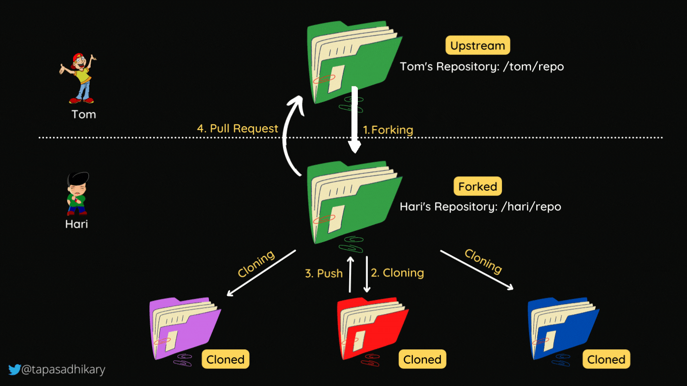

# Collaboration in Git: Unlocking Seamless Teamwork 🤝

In the world of software development, collaboration is key. Whether you're working on a small project with a friend or contributing to a large open-source initiative with a global community, effective collaboration is essential. Git, the powerful distributed version control system, provides a range of tools and workflows to make teamwork seamless and productive. In this article, we'll explore essential collaboration techniques and best practices in Git.

## Table of Contents 📚

- [The Problem with Working on a Single Branch](#the-problem-with-working-on-a-single-branch)
- [Feature Branch Workflow](#feature-branch-workflow)
- [Adding GitHub Collaborators](#adding-github-collaborators)
- [Collaborating with Others Using Git](#collaborating-with-others-using-git)
- [Pull Requests: The Collaboration Gateway](#pull-requests-the-collaboration-gateway)
- [Branch Protection Rules](#branch-protection-rules)
- [Understanding Forking](#understanding-forking)
- [Working with Your Forked Repository](#working-with-your-forked-repository)
- [Syncing with the Upstream Repository](#syncing-with-the-upstream-repository)
- [Contributing to the Upstream Project](#contributing-to-the-upstream-project)

## The Problem with Working on a Single Branch 🌲

Imagine you and your team are working on a project, all making changes directly on the `main` branch. Chaos ensues as conflicts arise, and it becomes nearly impossible to keep track of who did what. This is the problem with working on a single branch – it leads to confusion, wasted time, and potential loss of work.

## Feature Branch Workflow 🚀

To solve the chaos of working on a single branch, Git offers the **feature branch workflow**. Here's how it works:

1. **Create a Feature Branch**: Instead of making changes directly on the `main` branch, create a new branch for each feature or bug fix you're working on. For example:

   ```bash
   git checkout -b feature/new-feature
   ```

2. **Work on Your Feature**: Make your changes, commit them, and push your feature branch to the remote repository.

   ```bash
   git commit -m "Add new feature"
   git push origin feature/new-feature
   ```

3. **Pull Requests (PRs)**: When your feature is complete and tested, open a pull request to merge your changes into the `main` branch. This allows your team to review and discuss the changes before merging.

## Adding GitHub Collaborators 🤝

If you're using GitHub for your Git hosting, you can easily collaborate with others by adding them as **collaborators** to your repository. Collaborators have push access to the repository, allowing them to contribute directly. Here's how you can add a collaborator:

1. Go to your GitHub repository.

2. Click on **Settings**.

3. In the left sidebar, select **Manage access**.

4. Click the **Invite a collaborator** button.

5. Enter the collaborator's GitHub username or email address.

6. Choose their role (typically, you'd select **Write** access).

7. Click **Add collaborator**.

The collaborator will receive an email invitation to access the repository.

## Collaborating with Others Using Git 🔄

Git makes it easy to collaborate with others on a shared project. When collaborating:

- Pull changes from the remote repository regularly to keep your local repository up to date.
  
  ```bash
  git pull origin main
  ```

- Before pushing your changes, always ensure your local branch is in sync with the remote branch.
  
  ```bash
  git pull origin feature/new-feature
  ```

## Pull Requests: The Collaboration Gateway 🌉

Pull requests (PRs) are at the heart of collaboration in Git. They allow you to propose changes, discuss them, and merge them into the main codebase. Here's how PRs work:

1. You fork a repository or create a feature branch.

2. You make changes, commit them, and push your branch.

3. You open a pull request from your branch to the main repository.

4. Others review your changes, ask questions, and discuss the code.

5. Once your changes are approved, they are merged into the main branch.

## Branch Protection Rules ⚔️

To ensure code quality and stability, repositories often have branch protection rules. These rules can prevent direct pushes to certain branches, require code reviews before merging, and enforce status checks (such as passing tests) for PRs. Branch protection rules are a powerful tool for maintaining the integrity of a project.



## Forking: Your Own Copy of a Repository 🍴

Forking is a way to create your copy of a repository, often used when you want to contribute to someone else's project. Here's how it works:

1. Visit the repository you want to fork on the platform (e.g., GitHub).

2. Click the "Fork" button. This action creates a copy of the repository under your account.

3. Once forked, you can clone your forked repository to your local machine using Git commands like `git clone`.

4. Make changes, commits, and push them to your fork as needed.

5. If you wish to contribute changes to the original repository, you can create a pull request from your fork. The original repository's maintainers can then review your changes and decide whether to merge them.


# Forking and Upstream Repositories: A Guide to Open Source Collaboration 🍴🔄

In the world of open-source software development, collaboration is the name of the game. Forking and working with upstream repositories are fundamental concepts that enable developers to contribute to projects they don't own. In this guide, we'll explore forking, upstream repositories, and the workflow for effective collaboration in the open-source community.


## Understanding Forking 🍴

**Forking** is like making a copy of someone else's project on a platform like GitHub, giving you your playground to experiment with the code. Here's how it works:

1. You visit a repository you want to contribute to.

2. You click the "Fork" button on the platform (e.g., GitHub). This creates a duplicate of the repository under your account.

3. Now, you have your copy (fork) of the project, and you can make changes without affecting the original repository.


## Working with Your Forked Repository 🛠️

Once you have forked a repository, you can start working on your own copy of the project. Here are the steps:

1. **Clone Your Fork**: Clone your forked repository to your local machine. Replace `<your_fork_url>` with your repository's URL.

   ```bash
   git clone <your_fork_url>
   ```

2. **Create a New Branch**: Create a new branch for your work.

   ```bash
   git checkout -b feature/my-feature
   ```

3. **Make Changes**: Make the desired changes to the code.

4. **Commit Changes**: Commit your changes to your local repository.

   ```bash
   git commit -m "Add new feature"
   ```

5. **Push to Your Fork**: Push the changes to your fork on the platform (e.g., GitHub).

   ```bash
   git push origin feature/my-feature
   ```

## Syncing with the Upstream Repository 🔄

To keep your fork up to date with the latest changes from the original (upstream) repository, you need to add a remote that points to the upstream repository. Here's how to do it:

1. **Add Upstream Remote**: Navigate to the original repository on the platform and get the repository's URL. Replace `<upstream_repo_url>` with the URL.

   ```bash
   git remote add upstream <upstream_repo_url>
   ```

2. **Fetch Upstream Changes**: Fetch the latest changes from the upstream repository.

   ```bash
   git fetch upstream
   ```

3. **Merge Upstream Changes**: Merge the fetched changes into your local `main` branch.

   ```bash
   git checkout main
   git merge upstream/main
   ```

4. **Push to Your Fork**: Push the merged changes to your fork.

   ```bash
   git push origin main
   ```

## Contributing to the Upstream Project 🚀

Once your fork is in sync with the upstream repository, you can contribute your changes back to the original project. Here's how:

1. **Create a Pull Request**: On the platform (e.g., GitHub), open a pull request from your branch to the original repository's branch.

2. **Describe Your Changes**: Provide a clear description of your changes in the pull request, so the maintainers understand the purpose of your contribution.

3. **Discuss and Review**: Collaborate with the maintainers and other contributors to review your code, address any questions, and make necessary improvements.

4. **Merge Your Changes**: Once your changes are approved, the maintainers will merge your pull request into the upstream repository.


## Conclusion 🌟

Collaboration is the lifeblood of modern software development, and Git provides the tools and workflows to make it efficient and productive. Whether you're using feature branches, collaborating with GitHub collaborators, or forking and creating pull requests, Git empowers you to work seamlessly with others, contributing to projects big and small.

By following these collaboration techniques and best practices, you'll be well-equipped to collaborate effectively in the world of software development. Happy collaborating! 🚀👨‍💻

Happy coding! 🤝
s