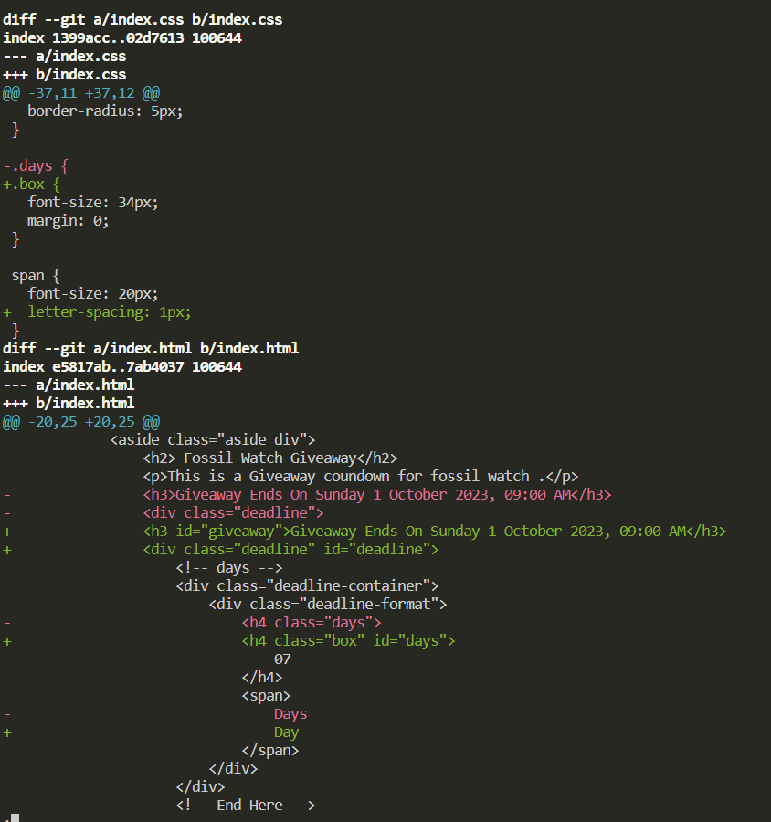
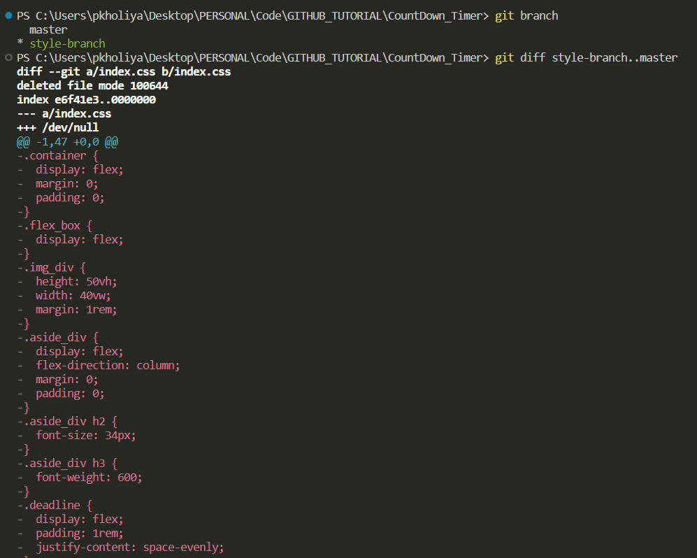
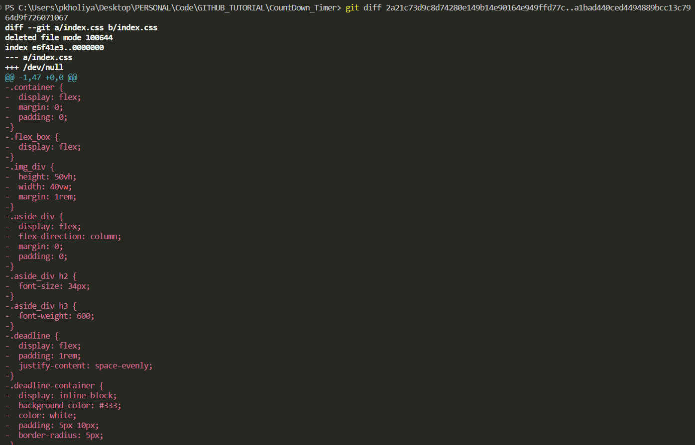

# Comparing Changes with Git Diff

## Introduction

Understanding and visualizing changes in your codebase is crucial for effective version control and collaboration in software development. Git, a powerful distributed version control system, provides various tools for comparing changes between different versions of your project. In this article, we will explore the Git `diff` command, its basics, and how it can be used to compare changes in branches, commits, and specific files. We'll also delve into the `git diff --staged` command with practical examples to make the concepts easily understandable.

## Table of Contents

- [📖 Reading Diff](#reading-diff)
- [🚀 Git Diff Basics](#git-diff-basics)
- [🌿 Diffing Branches](#diffing-branches)
- [📝 Diffing Commits](#diffing-commits)
- [📄 Diffing Specific Files](#diffing-specific-files)
- [🚢 Git Diff --staged](#git-diff-staged)

## 📖 Reading Diff

Before diving into Git's `diff` command, it's essential to understand what a `diff` is. A `diff`, short for `difference`, is a comparison between two sets of code, typically two versions of a file. It highlights the lines that have been added, modified, or removed between the two versions, making it easy to see what has changed.

- A typical diff view might look like this:

    ```diff
    - This is the old line
    + This is the new line
    ```
    

- In this example, the - sign indicates a line that has been removed, and the + sign indicates a line that has been added.

## 🚀 Git Diff Basics

The `git diff` command is used to display differences between two or more sets of code. Here are some basic ways to use `git diff`:

 - **Staging Area** 📑: Think of the staging area as a clean, organized tray on your desk. It's where you decide which changes (papers) you want to keep. You can pick up a paper (change) from your messy desk (working directory) and place it neatly on the tray (staging area) if you want to include it in your project.

 - **Working Directory** 📂: This is like your workspace or desk where you do your work. It's where you make changes to your code files. Imagine it as your messy desk with papers scattered all over. These papers represent the code files you're working on.

 - **Commit** 📸: Once you've selected the papers (changes) you want to keep on the tray (staging area), you can think of making a "commit" as taking a photo of the tray. This photo captures all the changes you've chosen to keep. It's like creating a snapshot of your project's current state.

- `git diff`: This command displays the changes that are not yet staged (i.e. changes in your working directory but not added to the staging area) 🧹.

- `git diff --staged` or `git diff --cached`: This command displays the changes that are staged (i.e., changes that have been added to the staging area but not committed) 📦.

- `git diff <commit>`: This command shows the changes between the working directory and a specific commit.

- `git diff <commit1>..<commit2>`: This command displays the changes between two commits.

Now, let's explore these concepts in more detail.

## 🌿 Diffing Branches

When working on a software project with multiple branches, you might want to compare the differences between those branches. The `git diff` command can help you do this.

**Example:**

- Let's say you have two branches, `style-branch` and `master`, and you want to see the differences between them. You can use the following command:

    ```bash
    git diff style-branch..master
    ```
    

- This command will show you the differences in code between the `style-branch` and the `master` branch.

## 📝 Diffing Commits

Git allows you to compare changes between specific commits. This can be helpful when you want to understand what happened between two points in your project's history.

**Example:**

- Suppose you want to see the changes between two commits, identified by their commit hashes (e.g., `Styling` and `JS Code`). You can use the following command:

    ```bash
    git diff 2a21c73d9c8d74280e149b14e90164e949ffd77c..a1bad440ced4494889bcc13c7964d9f726071067
    ```
    

*This will display the differences between the two specified commits.*

## 📄 Diffing Specific Files

You can also use `git diff` to compare changes in specific files.

**Example:**

- Suppose you have made changes to two files, `file1.txt` and `file2.txt`, and you want to see the differences in `file1.txt`. You can use the following command:

    ```bash
    git diff file1.txt
    ```

    *This command will display the differences in `file1.txt` that are not yet staged (changes in your working directory but not added to the staging area) 📝.

## 🚢 Git Diff --staged

Now, let's dive into the `git diff --staged` command, which is particularly useful when you want to review changes that have been staged and are ready to be committed. This command allows you to see what will be included in your next commit.

**Example:**

- Suppose you have made changes to several files and have already added some of them to the staging area using `git add`. To view the differences between the staged changes and the last commit, you can use the following command:

    ```bash
    git diff --staged
    ```

    *This will display the differences between the files in the staging area and the last commit. It's a valuable step before committing because it allows you to review your changes and ensure you're only including what you intend to in the next commit.*

**Conclusion**

In the world of software development, Git's `diff` command is a valuable tool for tracking and understanding code changes. It allows developers to compare branches, commits, specific files, and staged changes. By mastering Git's `diff` capabilities, you can make informed decisions, maintain code quality, and collaborate effectively. Whether you're working solo or in a team, Git's `diff` commands are essential for version control success. Happy coding! 🚀🔍

