# Git Basic Commands: Your Path to Efficient Code Management

Git is a superhero 🦸‍♂️ in the world of software development, empowering developers to work collaboratively 👥, track changes 🔄, and manage code efficiently 💻. In this guide, we'll explore fundamental Git commands, providing real-world examples to help you master these essential tools.


## Setting the Stage 🎬
Imagine you've just embarked on an exciting coding project 💡. Your team is eager to share and collaborate on this venture. So, what's the first step? Create a repository on GitHub, of course! This repository will serve as a central hub 🏰 where your code can thrive.


### Step 1:  Initialize Your Local Repository 🏁

- First, you need to set up a Git repository on your local machine. Navigate to your project directory in your terminal and run:


    ```bash
    # To initiliaze an empty repo
    git init
    ```
     

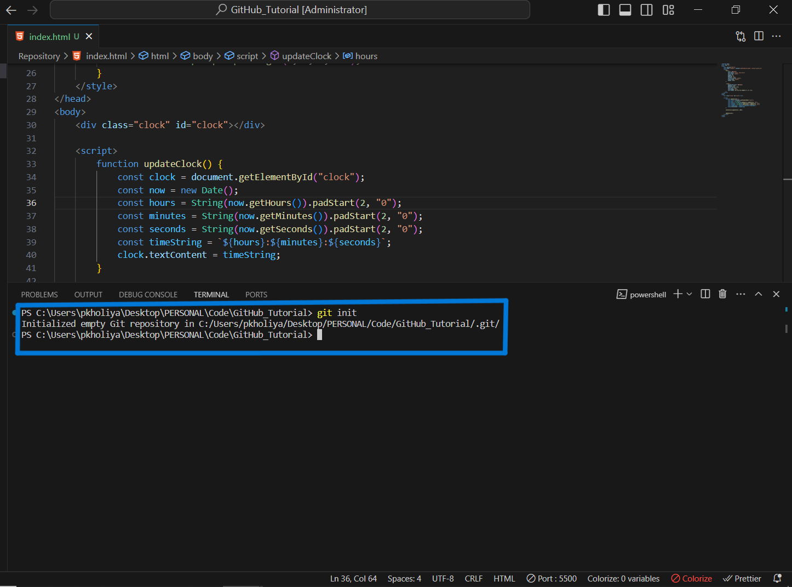
This command lays the foundation for version control.

### Step 2: Add Your Files 📂

- Now, it's time to decide which parts of your project you want to share. If it's a single file, simply add it like so:

    ```bash
    # 📂 To Add one file
    git add filename
    ```
    

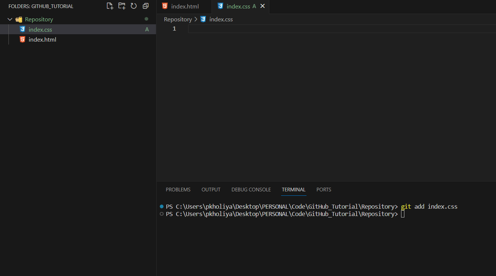
- Or, if you want to upload an entire directory 📦:

    ```bash
    # 📦 Add entire directory
    git add .
    ```
    

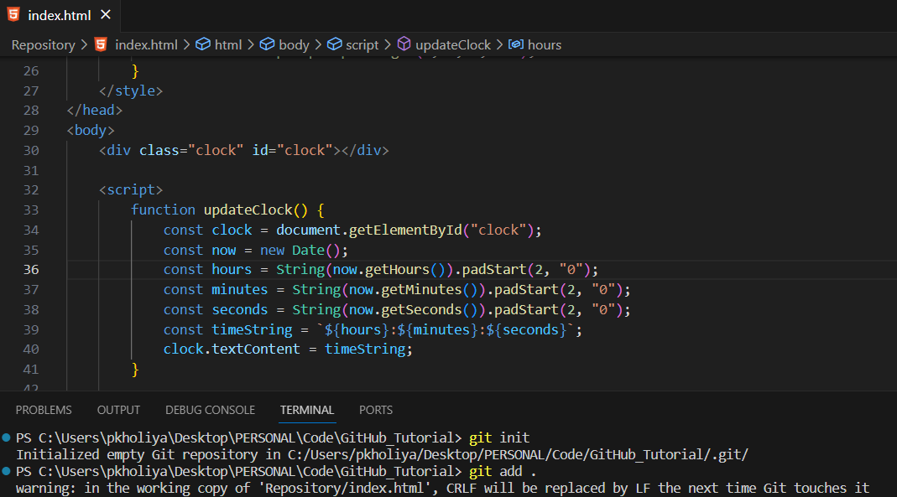

### Step 3: GitHub Repository Setup 🌐

- Head over to GitHub and create a new repository. You'll be greeted with a screen like this For more about how to set up new repo in github click [Here](https://github.com/ifeelpankaj/BLOGS/blob/dev/GitHub/Repository.md)

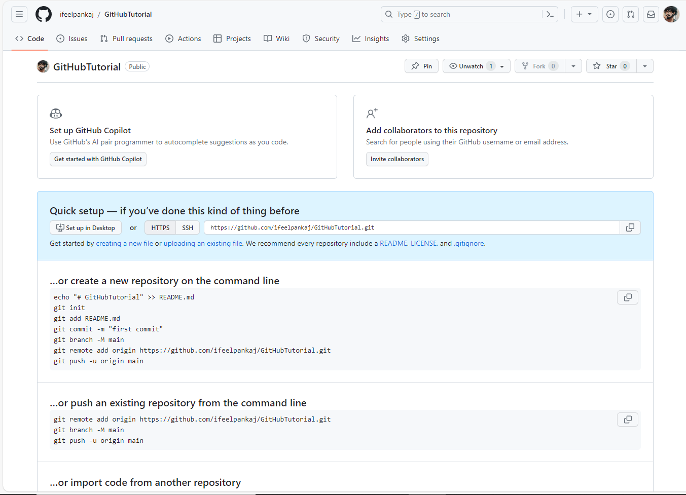

### Step 4: Status Check 🕵️

- Curious about which files you've added so far? The `git status` command will give you the lowdown on your current progress.


### Step 5: Commit Your Changes 💾

- A commit in Git is like saving a snapshot 📸 of your project at a specific moment in time. It records the changes you've made to your files. Execute this command:

    ```bash
    # 💾 Commit with a message
    git commit -m "Your descriptive commit message here"

    ```

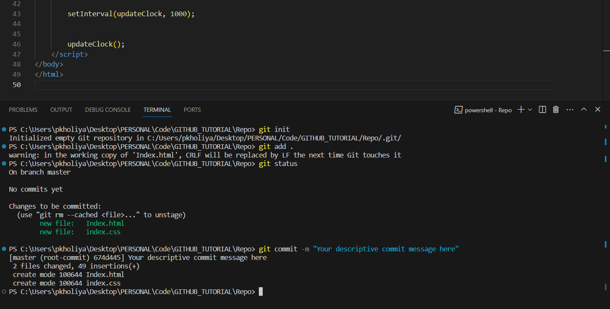

### Step 6: Branching Out 🌿

- Branches allow you to work on different features or versions of your project simultaneously. In this guide, we'll stick with the main branch. Create it using:

    ```bash
    # Declare Branch
    git branch -M main
    ```

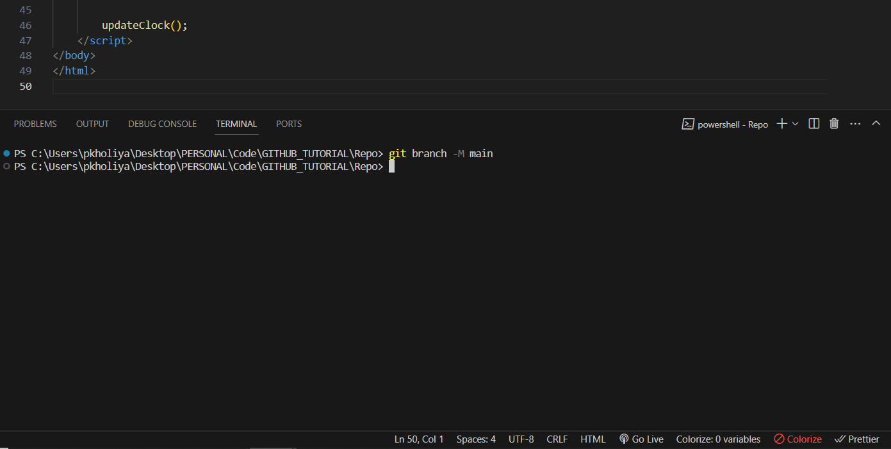

### Step 7: Remote Repository Connection 🌐

- Now, you need to tell Git where you want to push your code. You do this by adding a remote URL. Replace `<Your URL>` with your GitHub repository URL:

    ```bash
    #add remote url
    git remote add origin <Your URL>
    ```
    

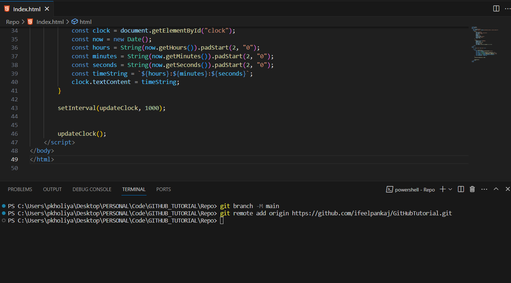

- To double-check, run:

    ```bash
    # check remote url
    git remote -v
    ```
    

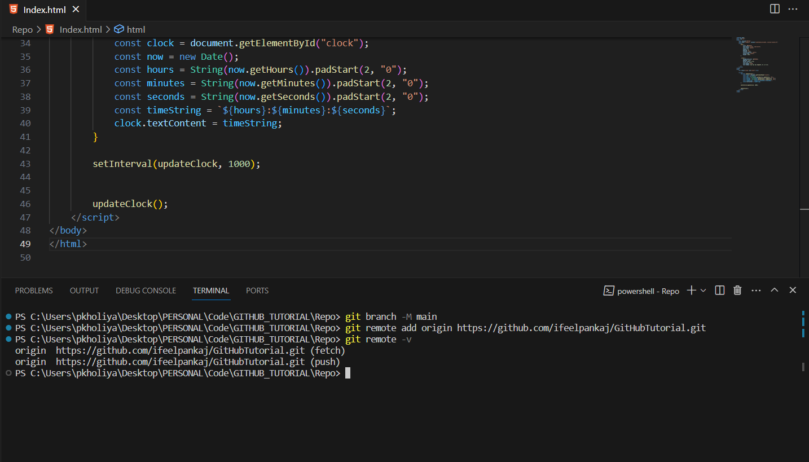

### Step 8:  Removing the Connection 🔌

- If you ever need to remove a remote connection, it's as easy as:

    ```bash
    #Remove 
    git remote remove origin
    ```
     

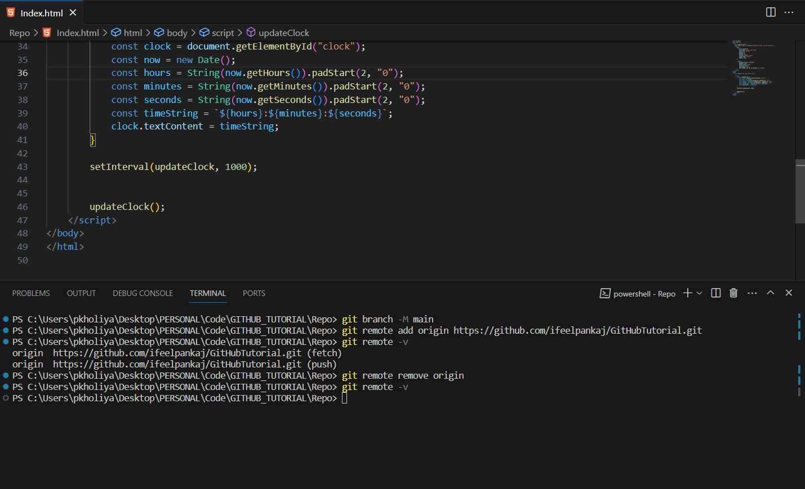

### Step 9: Push to GitHub 🚀

- You're almost there! To share your code with the world, push it to your GitHub repository:

    ```bash
    #Push Your Code
    git push origin main
    ```

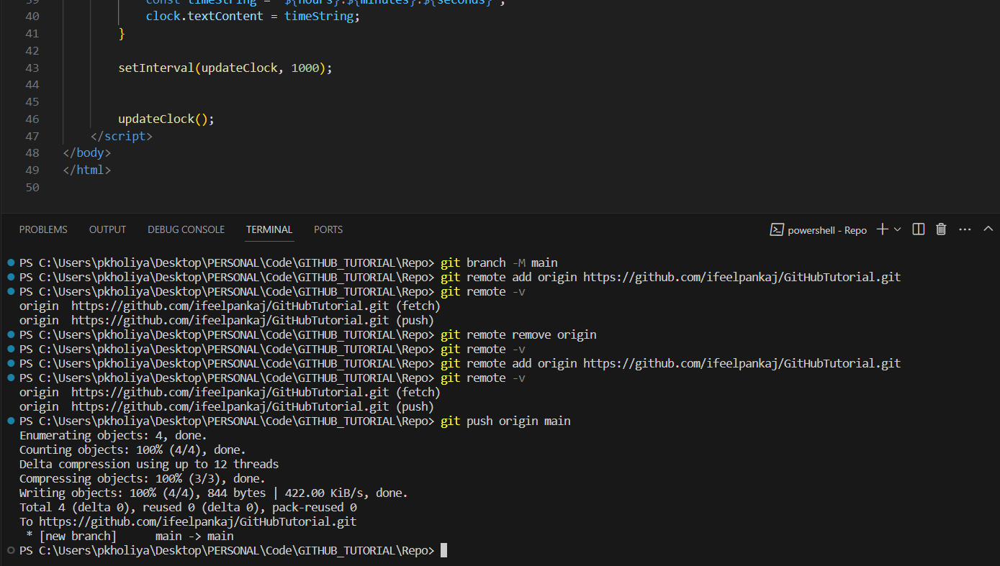

That's it! Your code is now securely stored on GitHub for your team to access and collaborate on.

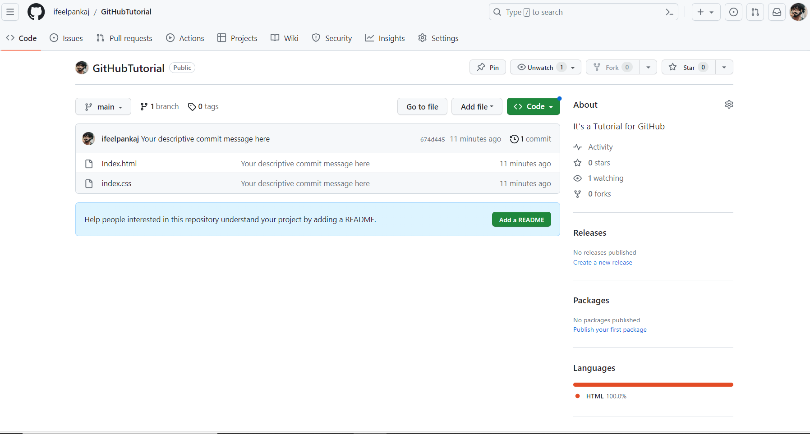

## A Few More Commands 🚩

### Git Log 📜

- Want to see a history of commits? Use `git log` :

    ```bash
    # View commit history
    git log
    ```
    

This command will display a list of commits with their unique hashes, authors, dates, and commit messages.
For our case We have so far we have done only one commit

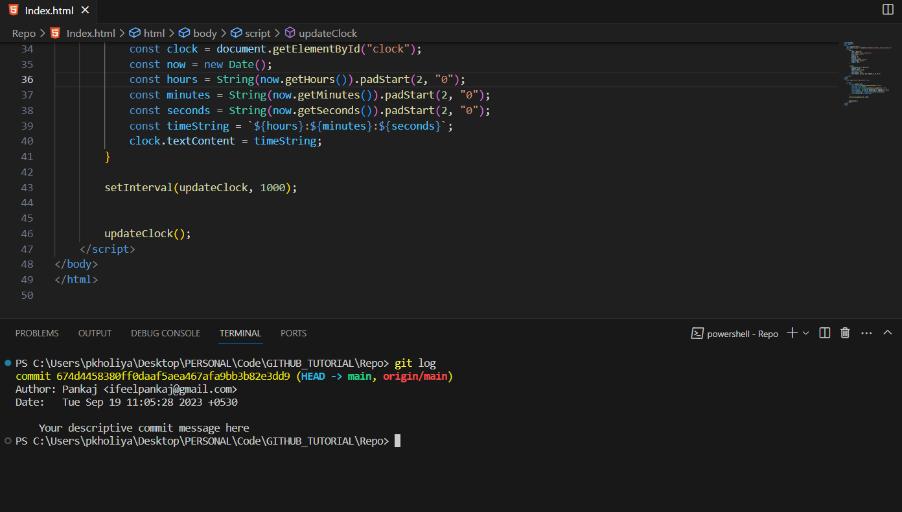

### Git Diff 

- To see the differences between the current state of your files and the last commit, use `git diff` :

    ```bash
    # Compare current changes with the last commit
    git diff
    ```
    

This command provides a line-by-line breakdown of changes made to your files.

That's it! Your code is now securely stored on GitHub for your team to access and collaborate on.

For Now we have added Comment in Css File 

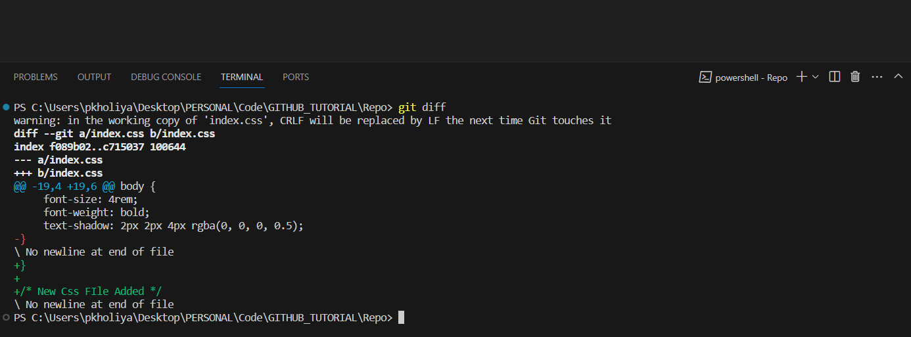


### Git Clone 📥

Suppose there is a repository on GitHub that you want to work on, or let's say you want to work on my repository, which I have created just now. Here's how you can use it on your local machine:

1. First, go to my GitHub profile [here](https://github.com/ifeelpankaj/GitHubTutorial)

2. Then, in your terminal, use the `git clone` command followed by the repository URL:
    
    ```bash
    #Clone my repo
    git clone <repositoryURL>
    ```
Simple! All the code will be cloned for you without affecting the original one. This is Git Clone. 🧬

Combine this with the above article to make it more colorful and use emojis to make it stylish! 🎨🌈✨

Remember, the key to mastering Git is practice. So, don't hesitate to explore, experiment, and continue your journey toward becoming a Git expert.

Now, go forth and code with confidence!

Author: Pankaj
