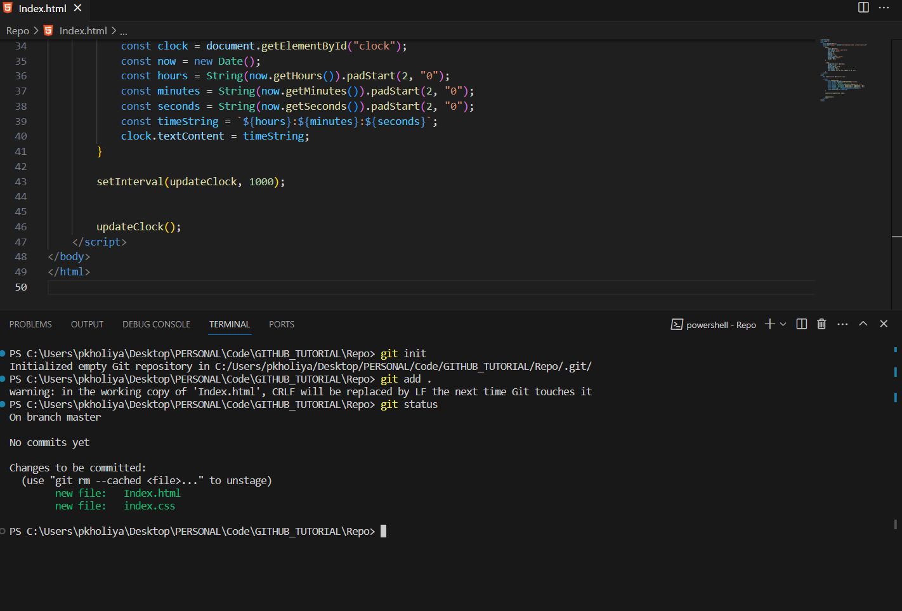

# Git Basic Commands: Your Path to Efficient Code Management

Git is a superhero 🦸‍♂️ in the world of software development, empowering developers to work collaboratively 👥, track changes 🔄, and manage code efficiently 💻. In this guide, we'll explore fundamental Git commands, providing real-world examples to help you master these essential tools.

## Setting the Stage 🎬
Imagine you've just embarked on an exciting coding project 💡. Your team is eager to share and collaborate on this venture. So, what's the first step? Create a repository on GitHub, of course! This repository will serve as a central hub 🏰 where your code can thrive.

### Step 1:  Initialize Your Local Repository 🏁

First, you need to set up a Git repository on your local machine. Navigate to your project directory in your terminal and run:

     # To initiliaze an empty repo
     git init

This command lays the foundation for version control.

### Step 2: Add Your Files 📂

Now, it's time to decide which parts of your project you want to share. If it's a single file, simply add it like so:

    # 📂 To Add one file
    git add filename

Or, if you want to upload an entire directory 📦:

    # 📦 Add entire directory
    git add .

### Step 3: GitHub Repository Setup 🌐

Head over to GitHub and create a new repository. You'll be greeted with a screen like this For more about how to set up new repo in github click [Here](https://github.com/ifeelpankaj/BLOGS/blob/dev/GitHub/Repository.md)

### Step 4: Status Check 🕵️

Curious about which files you've added so far? The `git status` command will give you the lowdown on your current progress.

### Step 5: Commit Your Changes 💾

A commit in Git is like saving a snapshot 📸 of your project at a specific moment in time. It records the changes you've made to your files. Execute this command:

    # 💾 Commit with a message
    git commit -m "Your descriptive commit message here"

### Step 6: Branching Out 🌿

Branches allow you to work on different features or versions of your project simultaneously. In this guide, we'll stick with the main branch. Create it using:

    git branch -M main

### Step 7: Remote Repository Connection 🌐

Now, you need to tell Git where you want to push your code. You do this by adding a remote URL. Replace `<Your URL>` with your GitHub repository URL:

    git remote add origin <Your URL>

To double-check, run:

    git remote -v

### Step 8:  Removing the Connection 🔌

If you ever need to remove a remote connection, it's as easy as:

      git remote remove origin

### Step 9: Push to GitHub 🚀

You're almost there! To share your code with the world, push it to your GitHub repository:

      git push origin main

That's it! Your code is now securely stored on GitHub for your team to access and collaborate on.

Remember, the key to mastering Git is practice. So, don't hesitate to explore, experiment, and continue your journey toward becoming a Git expert.

Now, go forth and code with confidence!

Author: Pankaj
