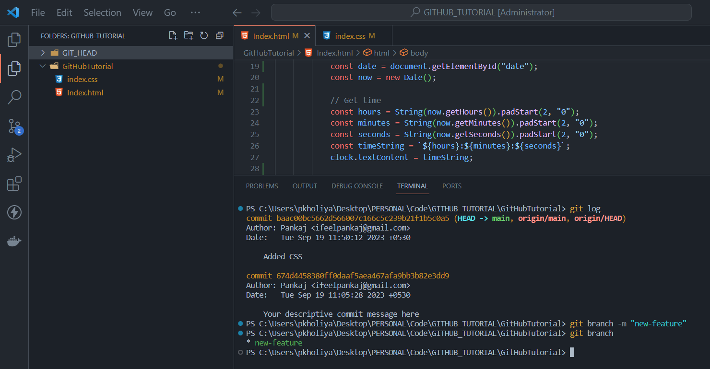
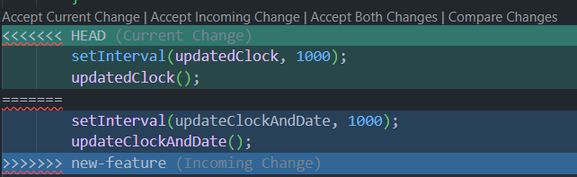

# Mastering Git Branches: From Creation to Conflict Resolution

## Introduction

In the world of version control systems, Git reigns supreme, thanks in no small part to its powerful branching and merging capabilities. This article is your comprehensive guide to understanding, creating, switching, and merging Git branches. We'll cover everything from the fundamentals of branching to the intricacies of handling merge conflicts, all while addressing the main vs. master branch debate. So, let's dive in!

## Table of Contents

- [What are Git Branches?](#what-are-git-branches)
- [Master vs. Main Branch](#master-vs-main-branch)
- [Creating and Switching Branches](#creating-and-switching-branches)
- [Merging Branches](#merging-branches)
- [Deleting and Renaming Branches](#deleting-and-renaming-branches)
- [Understanding Git HEAD](#understanding-git-head)


## What are Git Branches?

In the world of software development, Git branches are like parallel universes where you can work on different aspects of your project simultaneously. They provide a way to separate your work into distinct lines of development, allowing you to make changes and experiment without affecting the main or stable version of your code. Let's break down this concept further:

### Example

Imagine we're working on a software project, let's call it `CLOCK` and we're using Git for version control. In this project, we have a main branch called "main" . This main branch represents the stable version of your software that's currently in production. It's like your project's blueprint at a specific point in time.

Now, let's introduce the concept of Git branches using an example scenario:

Scenario: Adding a Date Feature

Let's say we have to add new feature in our project named `CLOCK` .This feature involves along with time also showing date to the user. However, you're concerned that while developing this feature, you might accidentally break something in the stable version of the project. This is where Git branches come to the rescue. we will continue this example ..

### Why Use Branches: The Benefits of Using Branches in Git

Using Git branches offers several significant advantages:

1. **Isolation**: Branches provide a safe space to work on specific tasks. You can make changes without worrying about affecting the main project until you're ready.

2. **Collaboration**: In a team, each member can work on their own branches simultaneously. This promotes collaboration without stepping on each other's toes.

3. **Experimentation**: You can create branches to experiment with new ideas. If an experiment doesn't work out, you can simply discard the branch without affecting the main project.

4. **Bug Fixing**: Branches are perfect for isolating and fixing bugs. You can create a branch to address a specific issue, test the fix, and then merge it back into the main project when it's verified.

5. **Versioning**: Branches enable you to maintain multiple versions of your project simultaneously. For example, you might have one branch for the current stable release and another for a future version with new features.

## Master vs. Main Branch

1. **Historical Context of the "Master" Branch:**

   Historically, Git repositories commonly used the term "master" for the default branch. Think of this branch as the primary timeline of your project.

2. **The "Main" Branch Alternative:**

   In recent years, there has been a shift towards using "main" instead of "master" as the default branch name. This change is made to promote inclusive language and remove any potentially negative connotations associated with "master."

    **Pros and Cons of the Change:**

    - **Pros:** Using "main" is more inclusive and avoids any unintended racial or hierarchical associations. It aligns with a more inclusive and respectful approach to software development.

    - **Cons:** Some older Git tools and repositories may still use "master," which can cause compatibility issues when transitioning to "main." However, most modern Git tools support "main" as the default    branch name.

3. **Changing the Default Branch:**

   To change the default branch in a Git repository from "master" to "main," follow these general steps:

   - Rename the existing "master" branch to "main" using `git branch -m master main`.
   - Push the changes to the remote repository with `git push -u origin main`.
   - Update the default branch setting on your remote repository (e.g., GitHub, GitLab, or Bitbucket) to use "main" as the new default branch.


## Creating and Switching Branches

In this example, we'll use a project named "clock" to demonstrate how to create new branches and switch between them.

**Initial State:**

   - At the start, the "clock" project displays only the date.
    

   - There are only two commits in the project's history.
    

**Creating a New Branch for a New Feature:**

   - Now, we want to add another feature to the project to display the time alongside the date. To do this, we create a new branch called "new-feature" using the following Git command

       ```bash
       git branch new-feature
       ```

   

*You can verify the creation of the new branch using the `git branch` command.*

**Adding the New Feature**

- In the "new-feature" branch, we modify the code to include the time feature.

    

- After adding the time feature, we commit the changes.

    

## Merging Branches

   *Branches are essential for parallel development, but at some point, you'll want to bring your changes together. Git provides various methods for merging branches. Let's explore them*

**Fast-Forward Merges: What They Are and When to Use Them**

   **Fast-forward merge** is a straightforward way to integrate changes from one branch into another when there are no new commits on the target branch.

   **Example:**

   I had 2 branches: one is `master` and the other is `addReadme`. Initially, in my code, I only had a clock showing up in the `master` branch, and in the `addReadme` branch, I added one more file named `addReadme`.

   ***To perform a fast-forward merge:***

   1. First, switch to the `master` branch:

      ```plaintext
      git switch master
      ```
   2. Then, run the merge command:

       ```plaintext
       git merge addReadme
       ```
        

   *The fast-forward merge is completed, and the `master` branch now includes the changes from `addReadme`.*

### Resolving Merge Conflicts: Handling Conflicts Like a Pro

   ***Merge conflicts can happen during any merge scenario when Git cannot automatically reconcile changes between branches. Conflicts occur when the same part of a file has been modified differently in both branches.***

   **Example:**

   - Let say I want to add date functionality to the project. I create a new branch called `new-feature` and make a commit to add the date functionality.

        

   - Now, if a conflict arises, it usually occurs when someone else makes commits to the `master` branch while you're working on `new-feature`.

        

   - Now if we want to merge new feature into the master branch a conflict will arise
        

   *If a conflict arises, Git will indicate where the conflict occurred in the files.*

   *You can resolve conflicts by editing the conflicted files manually, choosing which changes to keep.*
        
 ***Merge Success***
## Deleting and Renaming Branches

   Git offers commands to help you manage your branches by removing or renaming them. Let's explore these branch management tasks:

**Removing Branches: `git branch -d` and `git branch -D`**

   - `git branch -d`: This command is used to delete a branch that has been fully merged into the main branch. It's the safer option and ensures that your work is safely integrated before deletion.

   **Example:**

   - To delete a branch that has been merged (e.g., "feature-branch"):

	    ```plaintext
	    git branch -d new-feature
	    ```

        

   - `git branch -D`: Use this command when you want to forcefully delete a branch, even if it contains unmerged changes. Be cautious with this option, as you may lose work if not careful.

   **Example:**

   - To forcefully delete a branch (e.g., "unmerged-branch"):
            
	    ```plaintext
	     git branch -D unmerged-branch
	    ```


   **Renaming Branches:**

   `git branch -m`:This command allows you to rename an existing branch to a new name

   **Example:**

   - To rename a branch (e.g., renaming "old-branch" to "new-branch"):

      ```bash
      git branch -m old-branch new-branch
      ```

## Understanding Git HEAD

In the world of Git, understanding the concept of Git HEAD is essential. It's like the compass that guides you through your project's history and development. Let's delve into Git HEAD and its role in branch management.
Screen show what is git head

### Unraveling the Mystery of Git HEAD

   **Git HEAD** is a pointer to the latest commit in your currently checked-out branch. It's like a bookmark in a book, telling you where you are in the project's history. When you open a project in Git, you are essentially on a particular branch, and Git HEAD points to the tip of that branch.

   Think of Git HEAD as the "You are here" indicator on a map. It tells you which commit you are currently working on and which commit will be the parent of your next commit.

### How Git HEAD Changes During Branch Operations

   To illustrate how Git HEAD changes during branch operations, let's use a simple analogy: writing a story in a text document using Git for version control. We'll start with one paragraph and progressively show how Git HEAD moves as we create branches and make commits.

   1.  Creating the Initial Commit

   - We begin with our story, and this initial version is our first "commit" in Git. At this stage, our project's history looks like this:

        

   - Git HEAD points to "Commit A," representing our document's state after the first paragraph.

   2. Adding a New Branch for a Climax

   - Now, let's say we want to create a climax for our story. We do this by adding a new branch called "climax" using the following command:

     ```bash
     git checkout -b climax
     ```

   - This command not only creates the new branch but also switches to it. Git HEAD now points to the same commit as before, which is "Commit A."

        

   3. Adding climax to the story

   In the "climax" branch, we write the climax of the main story and stage the changes


   When we commit these changes, Git HEAD advances to the new commit, which we'll call "Commit B.


   Git HEAD now points to "Commit B," representing our document's state with the added climax.
        

   4. Creating an Alternate Climax

   - Suppose we're unsure about the climax we just added and want to explore an alternative without losing the original. To do this, we create a new branch called "alternate-climax" using:

        ```bash
        git checkout -b alternate-climax
        ```

   - We then switch back to the "master" branch, and Git HEAD is now on "Commit A.

   - In the "master" branch, we only see the first paragraph since that's what "Commit A" contains. We write an alternate climax in this branch and commit the changes.


   - After committing, Git HEAD advances to the new commit in the "master" branch. This new branch is called "alternate-climax.

        
