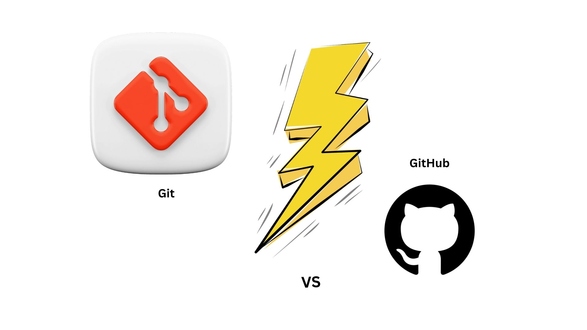

# Mastering GitHub: From Basics to Interview-Ready

  

In today's software development landscape, version control systems like Git and collaboration platforms like GitHub are essential skills for any programmer. GitHub, built around Git, is not only a hub for hosting repositories but also a crucial tool for teamwork and open-source contribution. This article will guide you from the fundamentals of GitHub to interview-ready expertise, covering common interview questions related to GitHub.

## GitHub Basics

### 1. What is GitHub?

GitHub is a web-based platform that utilizes the Git version control system. It provides a centralized location for hosting and collaborating on Git repositories. GitHub offers features such as issue tracking, pull requests, and project management tools.

### 2. Creating a GitHub Account

To get started with GitHub, create a free account on the [GitHub website](https://github.com/). You'll need to choose a unique username and provide an email address and password.

### 3. Git vs. GitHub: What's the Difference?

  

#### Git - The Tool for Tracking Changes

Imagine Git as a smart tool that helps programmers keep track of changes they make in their code. It's like a magical recorder that remembers every change you make to your code, whether it's adding new features, fixing bugs, or just making improvements.

##### How it works

Git sits on your computer, quietly doing its job, and it doesn't need the internet to work. It's your personal assistant for managing code changes.

#### GitHub - The Teamwork Platform

Now, imagine GitHub as a friendly place on the internet where you can share your code with others and work together, like a shared workspace. It's built around Git but adds extra features to make teamwork smoother.

##### How it works

GitHub is like a big, online office where you and your teammates can collaborate on coding projects. It's always online, so you need the internet to access it.

#### Key Differences

1. **Purpose:** Git is all about tracking code changes, while GitHub is about teamwork and sharing code.

2. **Type:** Git is a tool you use on your computer, no internet needed. GitHub is a website you access on the internet.

3. **Hosting:** Git doesn't host your code online; you have to do it yourself. GitHub hosts your code in the cloud, making it easy to share.

4. **Collaboration Tools:** Git doesn't come with fancy collaboration tools. GitHub has lots of features for working together, like code reviews and issue tracking.

5. **Visibility:** Git repositories are usually private, for your eyes only. GitHub repositories can be public (everyone can see) or private (only you and your chosen teammates).

6. **Licensing:** Git is free and open-source. GitHub offers free and paid plans, with extra features for paid users.

7. **Use Cases:** Git is for managing code changes. GitHub is for teamwork and project management. People often use them together for software development.

In simple terms, Git is your local code tracking buddy, and GitHub is the online platform where you and your team gather to code and collaborate. They're like Batman and Robin, each with their own role in the coding world.

## Author

Connect with the author on social media:

