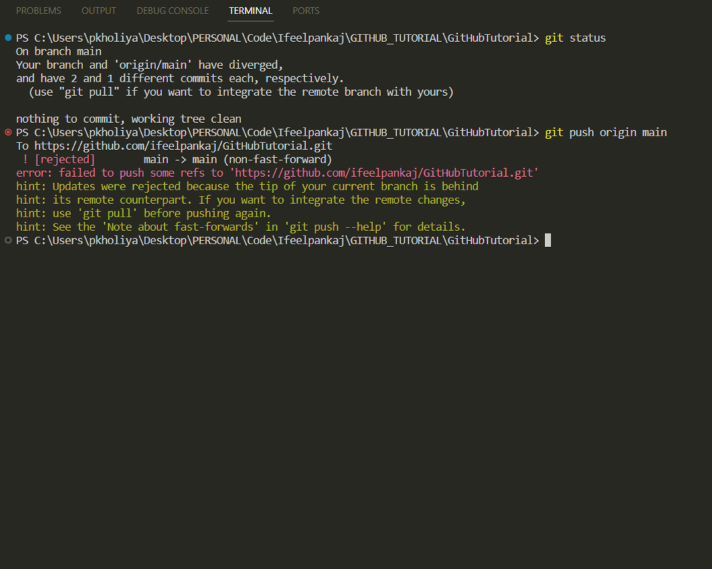

# Git Pull: Bringing Remote Changes to Your Local Repository

In the world of Git, staying up-to-date with changes made by your collaborators or on the remote repository is crucial. The `git pull` command is your trusty tool for this job. It fetches changes from a remote repository and integrates them into your local branch. Let's dive into the basics with an easy-to-understand example:

## Introduction

Imagine you're working on a collaborative software project with others. Each developer has their copy of the project, and you're using Git for version control. The project is hosted on a remote server, like GitHub, and multiple developers are making changes.

## The Scenario

- You're working on a main branch called `main`.
- Your teammate has made some changes and merged them into the `main` branch on the remote repository.

## Updating Your Local Repository

1. **Checking the Status:**

   Before pulling changes, it's a good practice to check your current branch's status using `git status`:

   ```bash
   git status
   ```

   This will show you if you have any local changes that need to be committed or stashed.

   

2. **Pulling Changes:**

   To bring the latest changes from the remote repository into your local branch, you can use the `git pull` command:

   ```bash
   git pull origin main
   ```

   - `origin` is the default name for the remote repository.
   - `main` is the name of the branch you want to pull from.

   

## Resolving Conflicts (if any)

If there are conflicting changes between your local branch and the remote branch, Git will notify you. Conflicts occur when both you and your teammate have made changes to the same part of a file.

1. **Reviewing Conflicts:**

   Open the conflicted file(s) in your code editor. Git will mark the conflicting sections:

   ```diff
   <<<<<<< HEAD
   Your changes here
   =======
   Their changes here
   >>>>>>> branch-name
   ```

   - The `<<<<<<< HEAD` section represents your changes.
   - The `=======` line separates your changes from your teammate's changes.
   - The `>>>>>>> branch-name` section represents your teammate's changes.

2. **Resolving Conflicts:**

   Manually edit the file to choose which changes to keep. Remove the conflict markers (`<<<<<<<`, `=======`, and `>>>>>>>`) and make sure the file looks as you want it to.

3. **Adding and Committing:**

   After resolving the conflicts, add the edited files to the staging area and commit the changes:

   ```bash
   git add <file1> <file2> ...
   git commit -m "Resolved conflicts"
   ```

## Pushing Your Changes

Once you've resolved conflicts and made your local branch up-to-date, it's a good practice to push your changes to the remote repository to keep it synchronized:

```bash
git push origin my-feature
```

- `origin` is the default name for the remote repository.
- `my-feature` is the name of your local branch.

## Conclusion

`git pull` is your go-to command for bringing remote changes to your local branch. It helps you collaborate seamlessly with your teammates by keeping your local repository up-to-date. In case of conflicts, don't panic! Git provides tools to help you resolve them and continue working effectively in a team. Happy coding! 🚀🔁