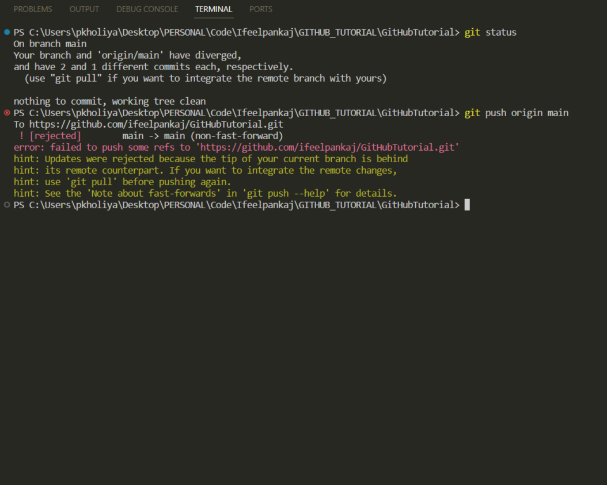
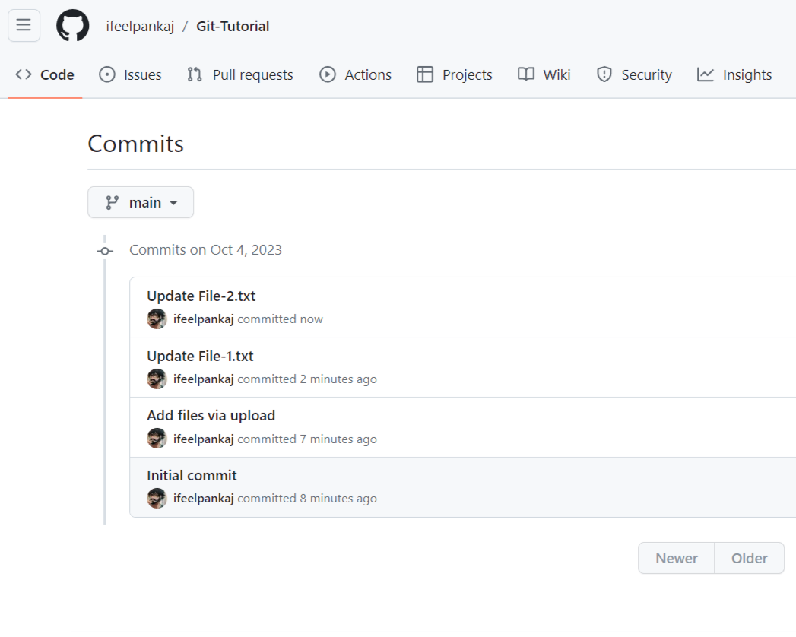
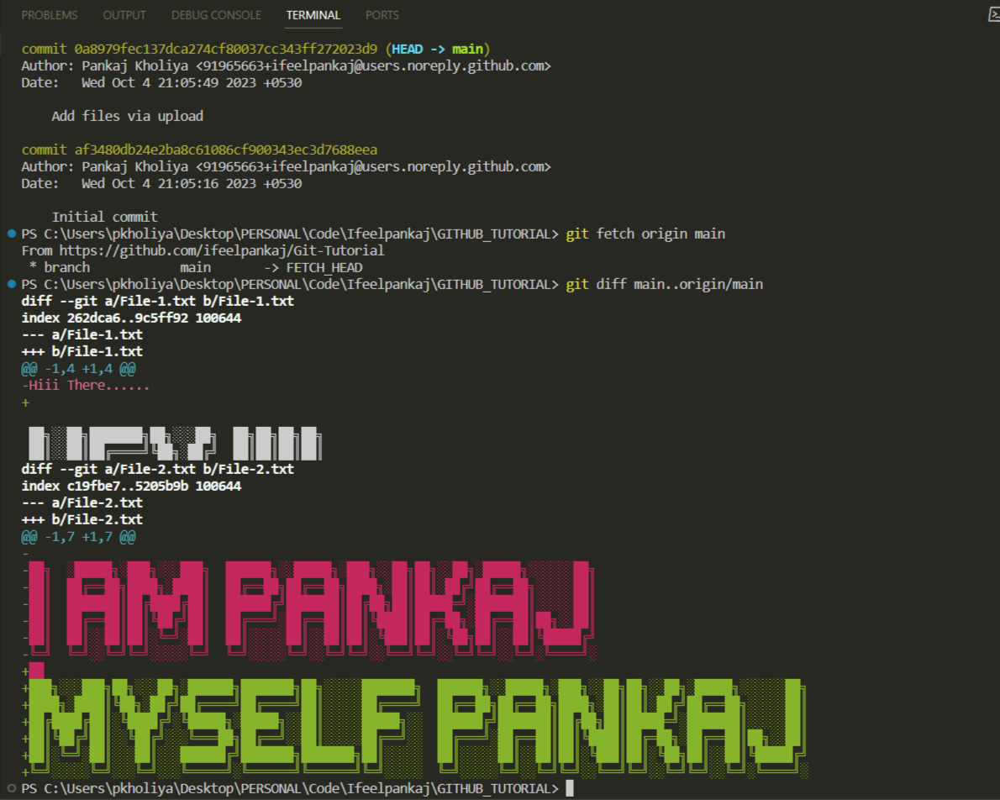
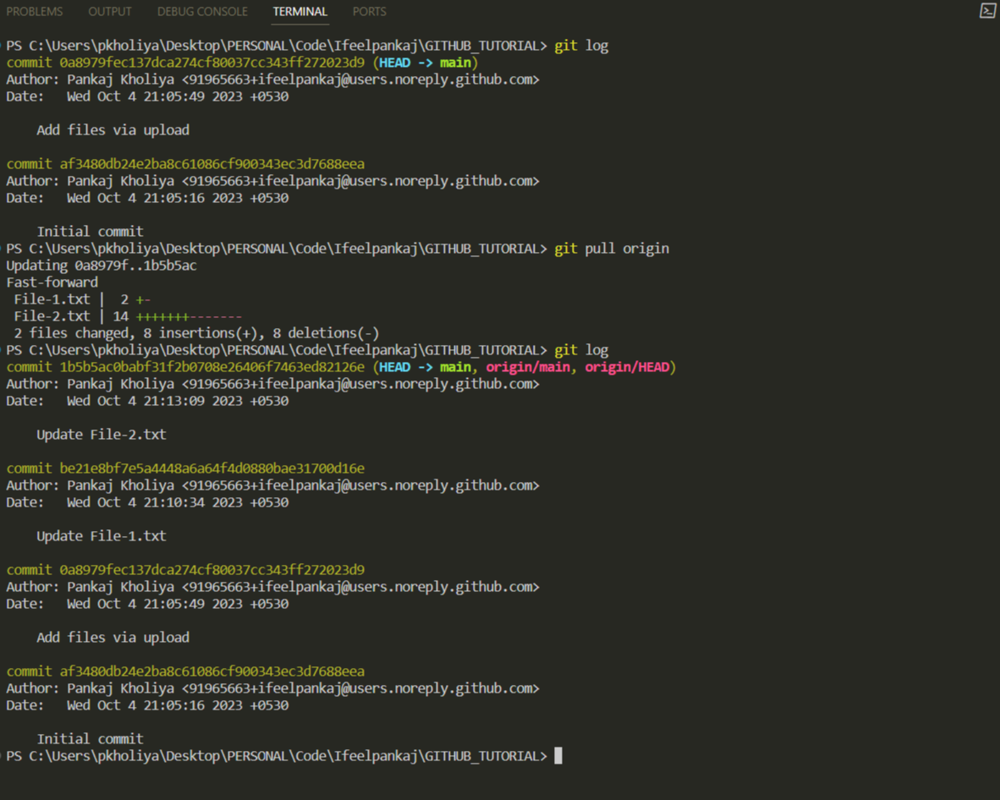
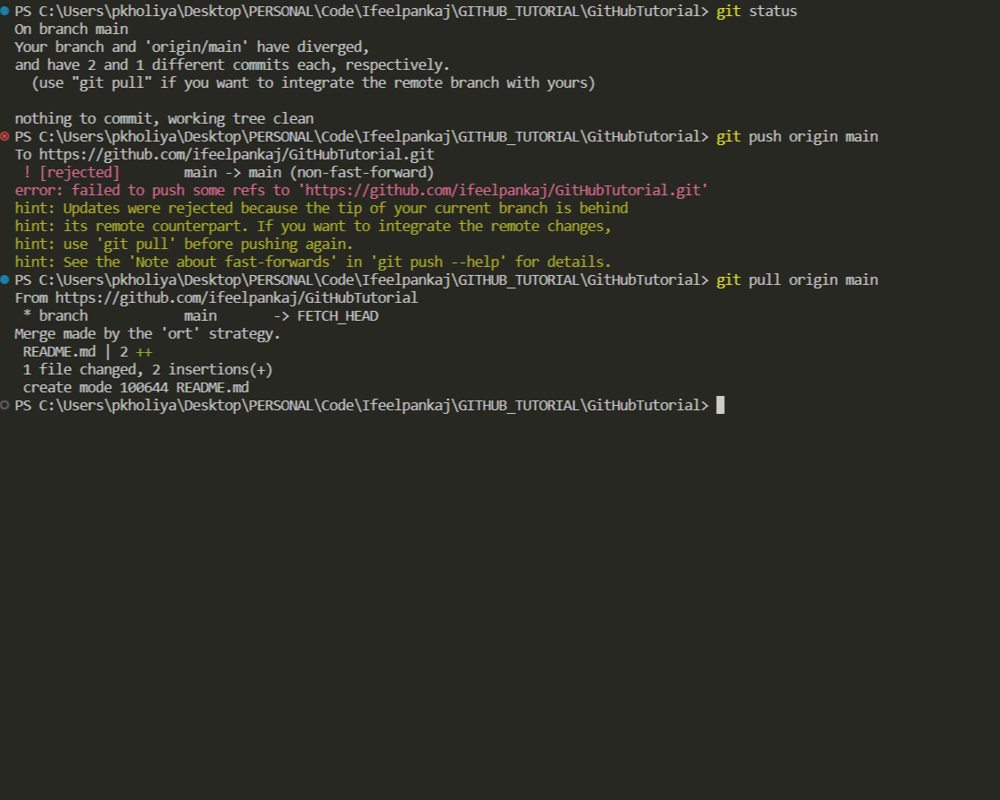

# Remote Repositories 🌐

In the world of distributed version control systems like Git, remote repositories play a pivotal role in enabling collaboration among developers, tracking code changes, and ensuring the integrity of your project. In this article, we will explore the essential concepts of remote repositories, including how to push changes to them, pull changes from them, and understand the difference between fetching and pulling.

## Table of Contents 📚

- [Pushing Changes to Remote Repositories](#pushing-changes-to-remote-repositories)
- [Fetching vs. Pulling](#fetching-vs-pulling)
- [Git Fetch vs. Git Pull](#git-fetch-vs-git-pull)

## Pushing Changes to Remote Repositories 🚀

When you're working on a project with a team or contributing to open-source development, sharing your code changes with others is a fundamental aspect of collaboration. This is where pushing changes to remote repositories comes into play.

**Steps to Push Changes:**

1. **Commit Your Changes**: Before pushing any changes, make sure you've committed your code modifications using `git commit`.

2. **Add a Remote**: To push your changes, you need to specify a remote repository. You can add a remote using the `git remote add` command. 🚧

   ```bash
   git remote add origin <remote_repository_url>
   ```

3. **Push Your Branch**: Use the `git push` command to send your committed changes to the remote repository. By default, this command pushes the current branch to the remote's matching branch.

   ```bash
   git push origin <branch_name>
   ```

4. **Authentication**: You might need to authenticate yourself, depending on the remote repository's settings. This can involve entering your username and password or using SSH keys for secure authentication. 🔑

5. **Verify Changes**: After pushing, you can visit the remote repository's web interface to verify that your changes have been successfully added. 👀


## Fetching vs. Pulling 🔄

Understanding the distinction between fetching and pulling is essential for efficient collaboration in Git.

- **Fetching**: The `git fetch` command retrieves changes from a remote repository but does not automatically merge or rebase them into your local branch. It merely updates your knowledge of what has changed in the remote repository.

- **Pulling**: The `git pull` command combines the `git fetch` and `git merge` (or `git rebase`) steps into one. It fetches remote changes and automatically integrates them into your local branch.

## Git Fetch vs. Git Pull: Understanding the Difference 🤔

### Using Git Fetch

#### The `git fetch` Command

The `git fetch` command is like a cautious librarian who checks if there are any new books in the library but doesn't immediately start reading them. It fetches changes from the remote repository and stores them locally, but it doesn't merge them into your current work. Instead, it places them in a separate branch, typically named `origin/main`, where `origin` is the default name of the remote repository.

#### Practical Example 📖

Let's illustrate this with a scenario:

1. You have cloned the repository to your local machine, and the remote repository on GitHub has the following commits:

   - Commit-A "Initial commit"
   - Commit-B "Add files via upload"

   

2. Meanwhile, other developers have pushed new commits to the remote repository:

   - Commit-C "Update File-1.txt"
   - Commit-D "Update File-2.txt"

   

3. You run `git fetch` to check for updates from the remote repository.

4. `git fetch` retrieves the new commits but doesn't merge them into your current branch. Instead, it updates your local repository with the new changes.

Now, your local repository includes:

- `main` (Your current branch with commits A, B)
- `origin/main` (A copy of the remote repository with commits A, B, C & D)

   

### Using Git Pull

#### The `git pull` Command

The `git pull` command is like a friend who not only checks for new books in the library but also starts reading them right away. It fetches changes from the remote repository and immediately merges them into your current work. In other words, it combines `git fetch` and `git merge` into a single command.

#### Practical Example 📖

Continuing from the previous scenario:

1. Your local repository has the following commits:

   - Commit-A "Initial commit"
   - Commit-B "Add files via upload"
   
2. Other developers have pushed new commits to the remote repository:

   - Commit-C "Update File-1.txt"
   - Commit-D "Update File-2.txt"

3. You run `git pull` to check for updates from the remote repository and merge them into your current branch.

4. `git pull` does the following:

   - Fetches the new commits (same as `git fetch`).
   - Merges the changes into your current working branch (e.g., `main`).

Now, your local repository and working branch (`main`) include the new commits (C and D) from the remote repository.



If you encounter an error like this, using the git fetch and git pull commands can help resolve the issue.



### Comparison

- `git fetch` checks for updates but doesn't change your work until you decide to merge.

- `git pull` checks for updates and immediately merges them into your work without asking for your permission.

The choice between `

git fetch` and `git pull` depends on whether you want more control over when changes are merged into your work or if you prefer an automatic update.

## Conclusion 🎉

Understanding the difference between `git fetch` and `git pull` is crucial for efficient Git workflow. Whether you choose to fetch changes cautiously or pull them automatically depends on your project's needs and your preference for control. With this knowledge, you can confidently manage updates from remote repositories and collaborate seamlessly with your team.

Happy coding! 🚀

In summary, remote repositories are the cornerstone of collaborative software development. They enable teams to work together seamlessly, share code changes, and maintain project integrity. Knowing how to push and pull changes effectively, as well as understanding the nuances of fetching and pulling, is essential for every Git developer.

Happy coding and collaborating! 🤝
