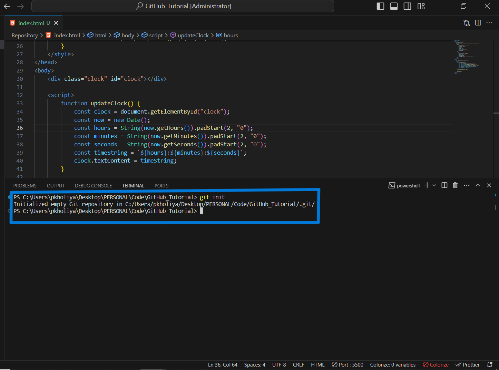
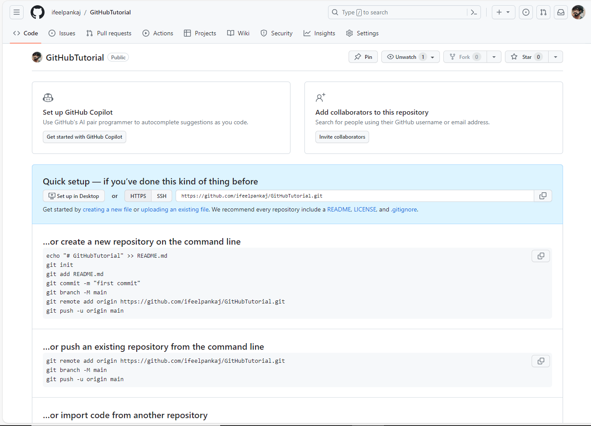

<!-- Repository Title -->
# 🚀 Understanding GitHub Repository (Repo)

GitHub is your launchpad for software development projects, where collaboration takes off! At the core of GitHub lies the mighty repository, often known as a "repo." In this README, we'll embark on a journey to explore what a repository truly is, distinguish between local and remote repositories, and provide you with vibrant examples to illuminate these fundamental concepts.

## 📁 What's a Repository?

A **repository** is the treasure chest of your project's digital world! It's where every file, folder, and the entire history of your project resides. Imagine it as a digital sanctuary where developers unite, monitor changes, and preserve a pristine record of their codebase—a kind of celestial filing cabinet.

### 🌟 Example:

Picture yourself crafting a magnificent website. You grace GitHub with a repository, a magical vault housing all your HTML, CSS, JavaScript, and image gems. This repository isn't just your code's home; it's also the vigilant guardian that meticulously records every change, a history keeper through time.

## 🏠 Local vs. 🌐 Remote Repositories

Now, let's embark on a journey to distinguish between two celestial realms: **local** and **remote** repositories.

### 🏡 Local Repository:

A **local repository** is your own secret garden, nestled right on your personal computer. It's your enchanted canvas, where you can paint code changes, conjure experiments, and cast spells of testing, all without unsettling the shared realm. Think of it as your sacred workspace.

### ✨ Example:

Suppose you've cloned a GitHub repository for a mobile app onto your computer. This clone is your personal haven, a realm where you can shape changes, forge new features, and test them, all behind the curtain until you're prepared to unveil your creations.

### 🌌 Remote Repository:

A **remote repository** resides in the celestial realms of servers, often on platforms like GitHub, GitLab, or Bitbucket. It's the grand arena where the fellowship of developers collaborates, contributes, and accesses the latest manifestation of the project. Every transformation made in the remote realm is visible to all the heroes of the project.

### 🚀 Example:

When you summon the power to push your local changes to a remote repository on GitHub, your code ascends to the heavens, becoming accessible to your comrades. They can review, make comments, and even merge your changes into the heart of the project.

In conclusion, local repositories are your private sanctuaries, where you craft code changes in solitude. In contrast, remote repositories are the bustling epicenters of collaboration, where every member of the fellowship can contribute and witness the latest incarnation of the project.

In the realm of software development, mastering the art of repositories—both local and remote—is the key to harmonious collaboration and version control. GitHub, with its intuitive interface, has emerged as the celestial gateway for repository management and fostering camaraderie among developers. The next time you embark on a software quest, remember the repository's essence in orchestrating, tracking, and sharing your code with the universe! 🌟

<!-- Repository Creation Guide -->
# 🌟 Creating a Local and Remote Repository

In this mystical guide, we'll lead you through the arcane process of creating both a local sanctuary and a remote realm for your project. The local sanctuary resides on your computer, while the remote realm is hosted on a platform like GitHub, enabling a harmonious symphony of collaboration.

## 🏠 Creating a Local Sanctuary

1. **Enter the Realm of Your Project:** First, make sure you're within the realm where your project's treasures await.

2. **Awaken a Local Repository:** Unveil your terminal and navigate to your project's realm. Utter the incantation to initialize a local repository:

    ```plaintext
    git init
    ```

    

3. **Bestow Your Artifacts:** Contribute your project's artifacts to the sanctuary. You can do this by gently placing your files and folders within the realm.


4. **Enchant the Chronicle:** Chronicle your work within the repository with the following incantation:

    ```plaintext
    git commit -m "Initial commit"
    ```

    

## 🌐 Creating a Remote Realm

1. **Sign in to the GitHub Portal:** Journey to [GitHub](https://github.com) and gain access to your account.

2. **Conjure a New Repository:** Seek out the "New" portal to conjure a new realm.

    

3. **Bestow Realm Details:** Bestow upon your realm a name, offer a brief description, choose its visibility (public or private), and, if you will, inscribe a README scroll or a license talisman. Then, by your decree, summon the "Create repository" ritual.


4. **Merge the Realms:** After creating the remote realm, you shall be granted instructions on uniting your local sanctuary with the remote realm. Follow these sacred instructions to link your realms together.

    

For how to push the code and for more operations stayed tuned

Congratulations, noble coder! You've triumphantly created both a local sanctuary and a remote realm for your project. Now, you may embark on your quest to collaborate with others, weaving code tales in the realm of GitHub and beyond.

May your code shine brightly in the cosmos! ✨🌌

