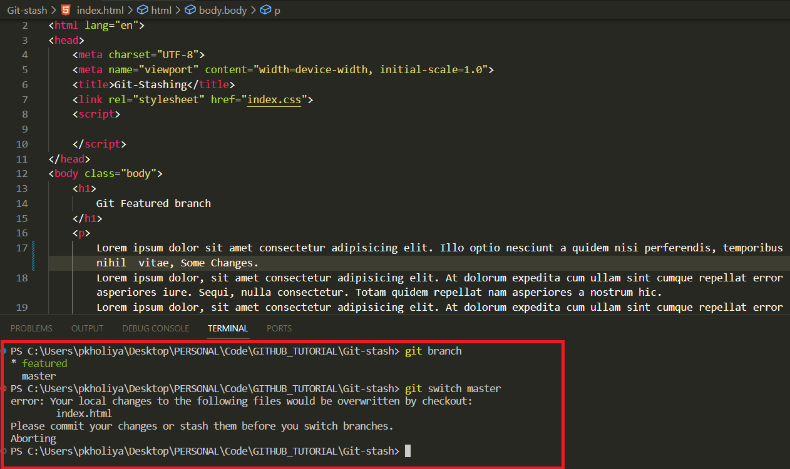
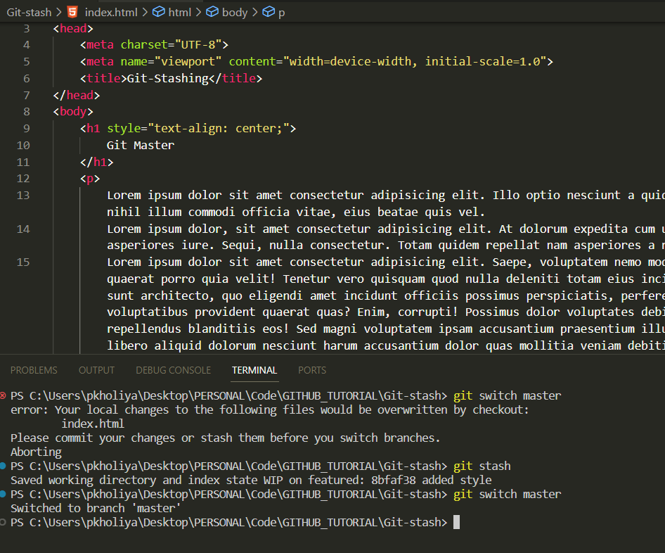
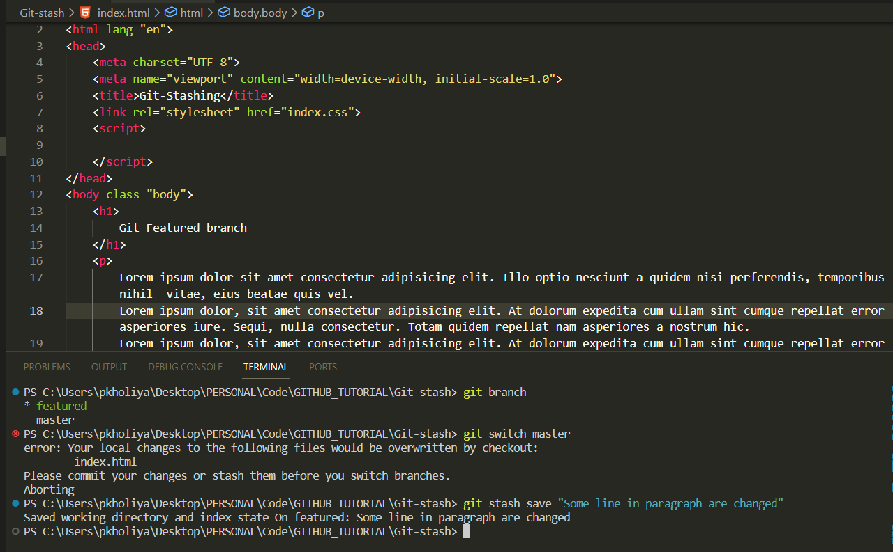
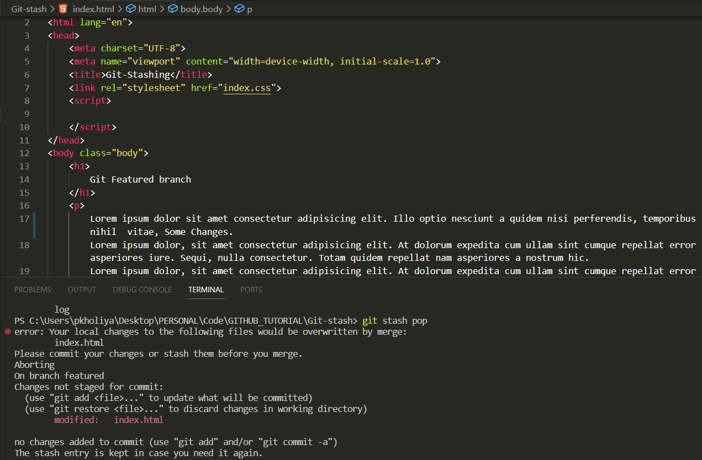
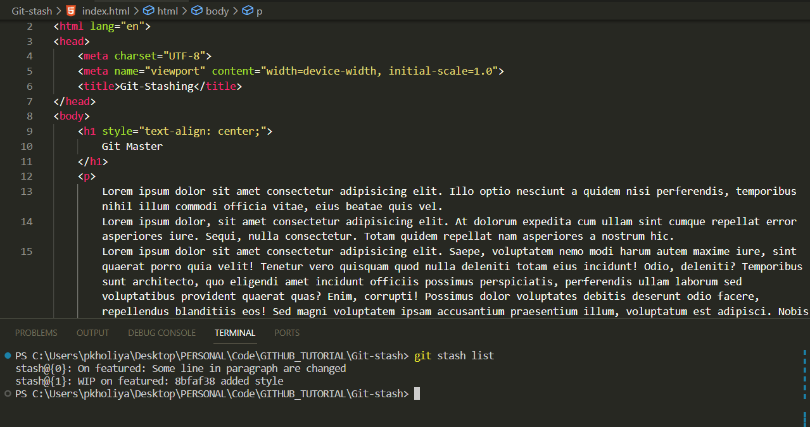
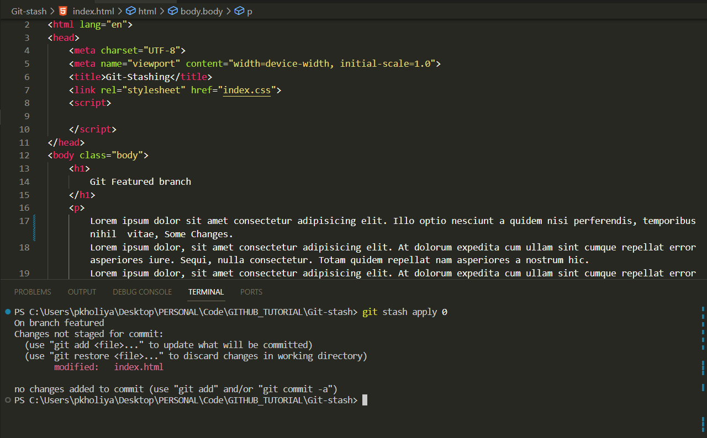
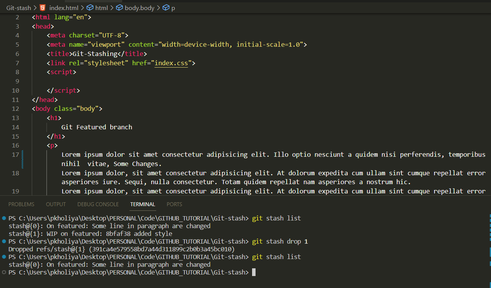
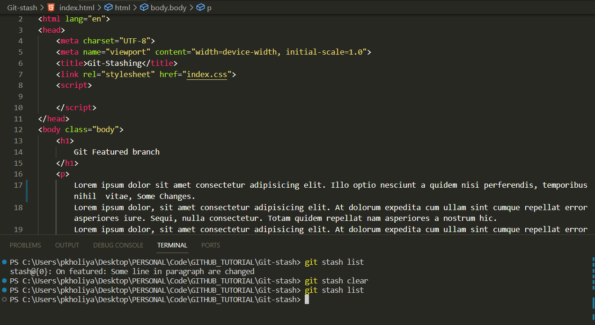

# Git-Stashing: Managing Your Work-in-Progress

🚀📦

## Introduction

🌟 In the dynamic realm of software development, the ability to seamlessly switch between tasks and branches is a valuable asset. Git's "stashing" feature offers a lifeline in situations where you need to park your current work temporarily. Stashing allows you to save your work-in-progress without committing it, keeping your working directory clean and your changes safe. In this article, we'll dive into the essentials of Git stash, including how to stash changes, apply stashed changes, and master the art of managing your stash stack.

## Table of Contents

- [Understanding Git Stash](#understanding-git-stash)
- [Stashing Changes](#stashing-changes)
- [Applying Stashed Changes](#applying-stashed-changes)
- [Managing Your Stash Stack](#managing-your-stash-stack)

## Understanding Git Stash

🎯 Git stash is like a secret storage space for your work-in-progress. It allows you to save your changes without committing them, creating a clean slate in your working directory. This is incredibly useful when you need to:

- 🚀 Swiftly switch to a different branch.
- 🔄 Pull in urgent changes from a remote repository.
- 🧪 Experiment with new ideas without the commitment of committing.
- 📚 Keep your work organized, even in the face of interruptions and context shifts.

## Stashing Changes

### Git Stash Basic

🛡️ The `git stash` command is your trusty companion when you find yourself in the midst of coding brilliance, but the call of another branch beckons. Let's paint a practical picture to see how it works:

**Example Scenario:**

🖼️ Picture yourself diligently crafting code on a feature branch called `feature-branch`. Your code is a work of art, but it's not quite ready for the world yet. Suddenly, a teammate's SOS on the `master` branch demands your expertise.

- You're neck-deep in `feature-branch` greatness, and you're not keen on committing your incomplete work. Committing could disrupt your masterpiece or clutter your commit history.

    

- In this scenario, you unleash the power of `git stash`. With a simple command, you stash your changes, magically reverting your working directory to the last committed state. But fear not, your changes are safe and sound, securely stored in the stash.

- To stash your changes with elegance, you merely run:

    ```bash
    git stash
    ```

   

    

*Behold, your changes are stashed away, and your working directory is pure and pristine, ready for your journey to the `master` branch.*

Now, with a clean slate, you gracefully switch to the `master` branch, ready to tackle the urgent matter at hand, with your masterpiece safely stashed away for later.

### Git Stash Save

- 🖋️ If you're the descriptive type and enjoy labeling your stashes, `git stash save` is your artistic palette:

    ```bash
    git stash save "Feature XYZ in progress"
    ```
    

*This allows you to attach a meaningful message to your stash, making it easier to identify its purpose when you have multiple stashes.*

## Applying Stashed Changes

🌈 So, you've stashed your brilliance, and now it's time to shine again. Git provides a couple of methods to reapply your stashed changes.

### Git Stash Pop

-  The `git stash pop` command is like a double shot of espresso for your changes. It not only applies your stashed work but also removes the stash itself:

    ```bash
    git stash pop
    ```
    

*This is perfect when you're absolutely sure you won't need that stash again.*

### Git Stash Apply

- 🧘 For a more cautious approach, `git stash apply` gently applies your stashed changes while keeping the stash intact:

    ```bash
    git stash apply
    ```

*This way, you can continue working on your stash and even apply it to different branches if your heart desires.*

## Managing Your Stash Stack

🗂️ With time, your stash collection may grow. It's essential to maintain it gracefully.

### Viewing Your Stash Stack

- 📜 To admire your stash stack, use the `git stash list` command:

    ```bash
    git stash list
    ```
    

*This command showcases your stashes, each with a unique identifier (e.g., `stash@{0}`, `stash@{1}`).*

### Applying a Specific Stash

- 🌟 If you have a treasure trove of stashes and wish to apply a specific one, use `git stash apply` or `git stash pop` followed by the stash's identifier:

    ```bash
    git stash apply stash@{1}
    ```
    

*This summons the stash at the specified index from your stash stack.*

### Deleting a Stash

- 🗑️ To bid farewell to a stash, utilize the `git stash drop` command followed by the stash's identifier:

    ```bash
    git stash drop stash@{2}
    ```
    

*This gracefully removes the stash at the indicated index.*

🚨 Be cautious when dropping stashes, as they cannot be easily recovered.

### Clearing Your Stash Stack

- 🧹 If you want to remove all stashes, you can use the `git stash clear` command:

    ```bash
    git stash clear
    ```
    

This action is irreversible, so use it with caution.

## Conclusion

Git stash is a valuable tool in your version control arsenal. It allows you to manage your work-in-progress effectively, enabling seamless context switching and organization of your development efforts. By stashing your changes, applying them when needed, and managing your stash stack, you can maintain a clean and efficient workflow in your software development projects. So go ahead, stash your work, and keep coding with confidence! 🚀📦